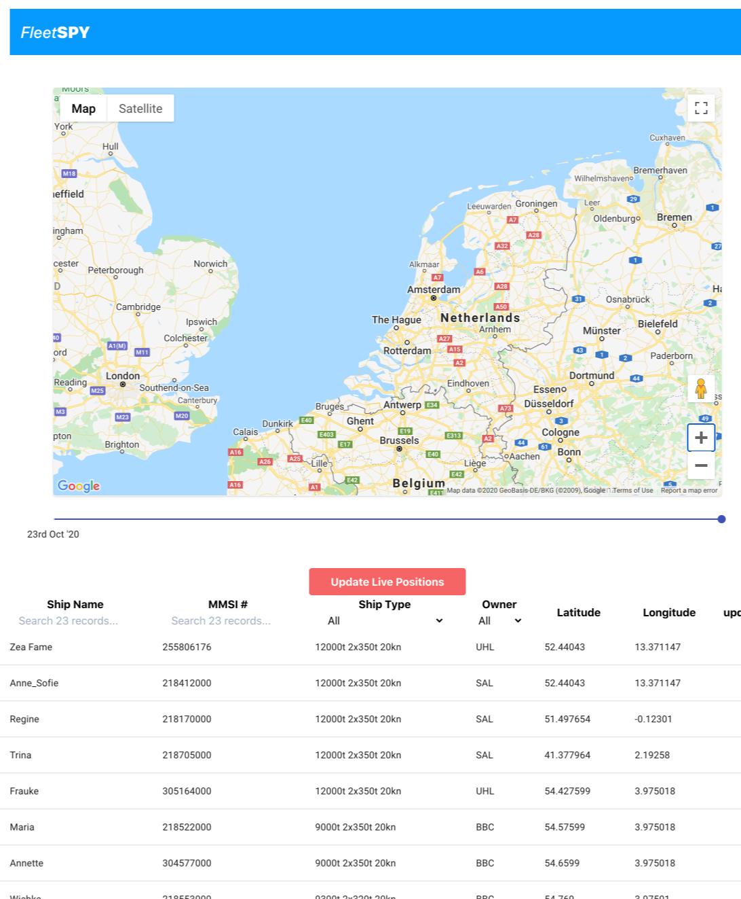

# FleetSpy


Past, present, and projected vessel positions. Powered by [marinetraffic.com](https://www.marinetraffic.com/).

## Screenshot



## Get started

1. Clone repo: <code>git clone https://github.com/atsteinberg/QueueAndA.git</code>
2. Install dependencies: <code>npm i</code> (if you haven't installed node and npm, the node package manager, do that first: [install npm](https://www.npmjs.com/get-npm))
3. Add .env file to react-tailwindcss folder with api key information:

```bash
REACT_APP_API_MARINETRAFFIC_PS07=<YOUR_API_KEY_GOES_HERE>
REACT_APP_API_MARINETRAFFIC_VI01=<YOUR_API_KEY_GOES_HERE>
REACT_APP_API_MAPS=<YOUR_API_KEY_GOES_HERE>
```

4. cd to react-tailwindcss foder and <code>npm start</code>

## Built with

- [React](https://reactjs.org)
- [Redux](https://redux.js.org)
- [TypeScript](https://www.typescriptlang.org)
- [tailwindcss](https://tailwindcss.com)
- [MarineTraffic API](https://www.marinetraffic.com/en/ais-api-services)
- [Google Maps API](https://developers.google.com/maps/documentation)
- [Blood, Sweat & Tears](https://bloodsweatandtears.com/)

## Developers

- Wilke Briese – project developer: [github](https://github.com/wbriese) -- [linkedin](https://www.linkedin.com/in/wilke-briese-b4b16755/)
- Edu Pinto – backend and design lead: [github](https://github.com/pintoedo)
- Alex Steinberg – tech lead: [github](https://github.com/atsteinberg) – [linkedin](https://www.linkedin.com/in/alexander-steinberg-7b7299194) – [web](atsteinberg.github.io)
